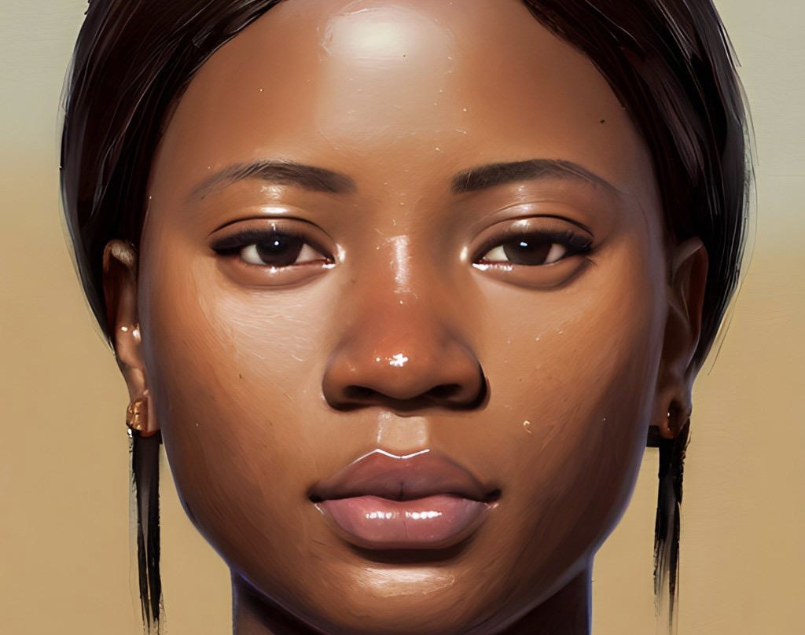

# 👯 The Blockchain Baddies

The team is made up of two beautiful ladies who started this journey as hackathon winners during the Techpoint Africa Web3 conference in May 2022, when the idea just started.&#x20;

## Amusat Khadijah Wuraola

Ceo and C0-founder - 💌  khadijah@delibra.xyz -  🇦🇪  (Dubai GMT+4)

<figure><figcaption></figcaption></figure>


Khadijah is a software and blockchain engineer who made the transition from public health education in 2020. She has also been an entrepreneur for the past 5 years and a model for 10 years. She loves going to the gym, swimming, cooking, and watching movies in her free time.

Aside from all of that she also engages in developer Relations, and is currently an ambassador for chimoney and a Google's Women tech maker ambassador


### Anyanwu Maureen Ezinne

CTO and CO-founder - 💌 maureen@delibra.xyz - 🇳🇬 (Lagos GMT+1)

<figure><figcaption></figcaption></figure>


Maureen is a front-end and blockchain developer. She is also a student of medical radiography at the University of Nigeria, Enugu Campus. She transitioned into tech in 2020 during the heat of Covid and has since been interested in tech especially health tech. She loves watching movies and hanging out with friends. Maureen is passionate about solving problems with her tech skills

